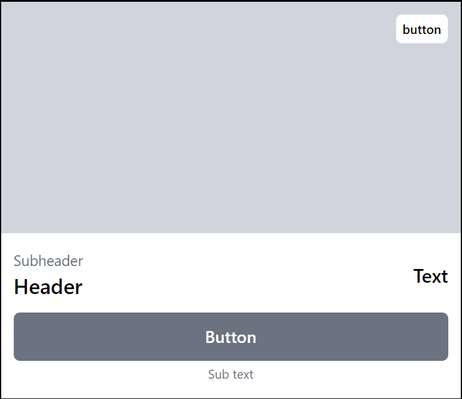
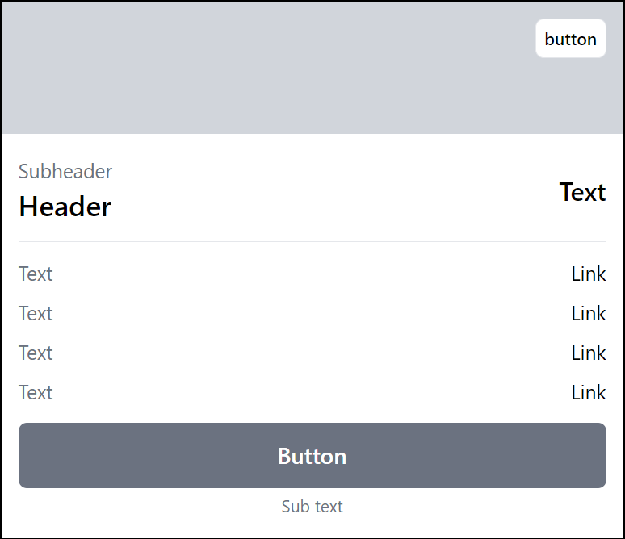

# Прототип карточки написанный на tailwindcss

### Просмотор

1. Скачать и распаковать архив проекта
2. Открыть файл index.html в браузере

### Макет

https://www.figma.com/design/90KCuRdMKCFkdzgh4k9teP/Tailwind-card?node-id=0-1&t=CcRP8qytT0XcZHJe-0